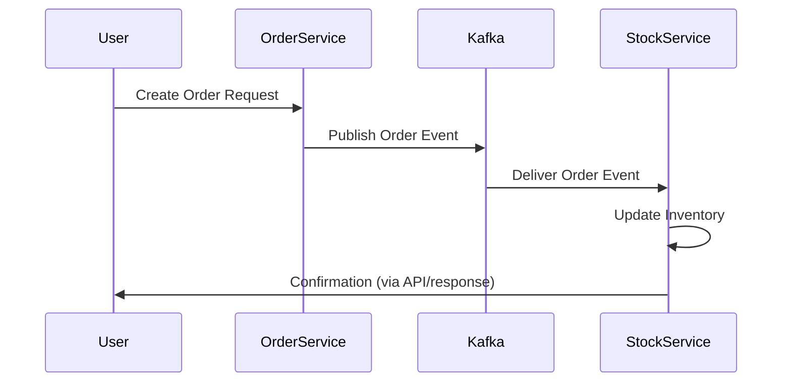

 📡 Spring Microservices Streaming with Kafka

A Java-based project demonstrating **event-driven microservices architecture** using **Spring Boot** and **Apache Kafka**. This repository showcases how multiple microservices can communicate asynchronously through Kafka topics, enabling scalable and resilient systems.

---

## 📌 Features
- **Microservices architecture** with separate modules:
  - **Base-Domain** – shared domain models and utilities  
  - **Order-microservice** – handles order creation and events  
  - **Stock-microservice** – manages stock updates and inventory events  
- Kafka producer and consumer integration  
- Event-driven communication between services  
- Spring Boot configuration for Kafka streaming  
- Maven-based project structure  

---

## 🛠️ Tech Stack
- **Language:** Java  
- **Framework:** Spring Boot  
- **Messaging Platform:** Apache Kafka  
- **Build Tool:** Maven  
- **Architecture:** Microservices  

---

## 📂 Project Structure
```
Spring-microservices-streaming-with--kafka/
│── Base-Domain/          # Shared domain models
│── Order-microservice/   # Order service (producer/consumer)
│── Stock-microservice/   # Stock service (producer/consumer)
│── .idea/                # IDE configuration
│── pom.xml               # Maven project configuration
│── README.md             # Documentation
```

---

## 🚀 Getting Started

### Prerequisites
- Java 17+  
- Maven 3.8+  
- Apache Kafka running locally or remotely  

### Installation
1. Clone the repository:
   ```bash
   git clone https://github.com/erickomondi760/Spring-microservices-streaming-with--kafka.git
   cd Spring-microservices-streaming-with--kafka
   ```
2. Build the project:
   ```bash
   mvn clean install
   ```
3. Run each microservice:
   ```bash
   cd Order-microservice
   mvn spring-boot:run

   cd ../Stock-microservice
   mvn spring-boot:run
   ```

---

## ⚙️ Configuration
Update `application.properties` in each microservice with your Kafka setup:
```properties
spring.kafka.bootstrap-servers=localhost:9092
spring.kafka.consumer.group-id=order-group
spring.kafka.topic.order=order-topic
spring.kafka.topic.stock=stock-topic
```

---

## 📡 Workflow
1. **Order Service** publishes an event when a new order is created.  
2. **Stock Service** consumes the order event and updates inventory.  
3. Both services communicate asynchronously via Kafka topics.  

---

## 📊 Sequence Diagram



---

## ☁️ Deployment

### Option 1: Local Server
Run each microservice individually with Maven.

### Option 2: Docker + Docker Compose
Create a `docker-compose.yml` to run Kafka and all microservices together:
```yaml
version: '3.8'
services:
  zookeeper:
    image: wurstmeister/zookeeper
    ports:
      - "2181:2181"

  kafka:
    image: wurstmeister/kafka
    ports:
      - "9092:9092"
    environment:
      KAFKA_ADVERTISED_LISTENERS: PLAINTEXT://localhost:9092
      KAFKA_ZOOKEEPER_CONNECT: zookeeper:2181

  order-service:
    build: ./Order-microservice
    ports:
      - "8081:8081"

  stock-service:
    build: ./Stock-microservice
    ports:
      - "8082:8082"
```

---

## 🔄 CI/CD Setup (GitHub Actions)
Automate builds and tests with GitHub Actions:

```yaml
name: Java CI with Maven

on:
  push:
    branches: [ "main" ]
  pull_request:
    branches: [ "main" ]

jobs:
  build:
    runs-on: ubuntu-latest
    steps:
    - name: Checkout code
      uses: actions/checkout@v3

    - name: Set up JDK 17
      uses: actions/setup-java@v3
      with:
        java-version: '17'
        distribution: 'temurin'

    - name: Build with Maven
      run: mvn clean install

    - name: Run tests
      run: mvn test
```

---

## 🤝 Contributing
Contributions are welcome!  
1. Fork the repo  
2. Create a new branch (`feature-xyz`)  
3. Commit changes  
4. Open a Pull Request  

---

## 📜 License
This project is licensed under the MIT License.
